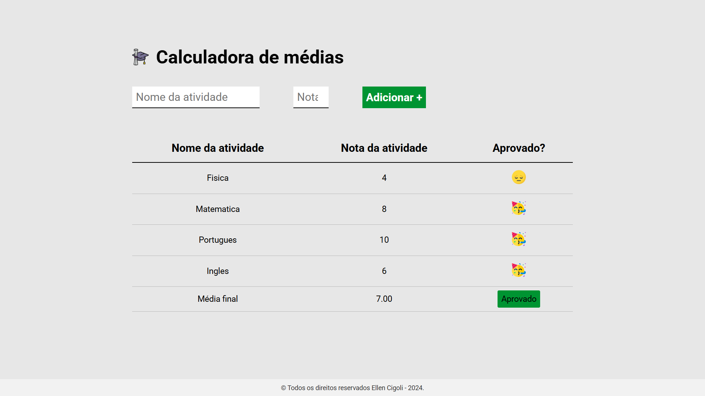

# 📘 Calculadora de Médias

Este é um projeto desenvolvido em **JavaScript, HTML e CSS**, que permite calcular a média das notas de atividades e determinar se o aluno foi **aprovado** ou **reprovado** com base em uma nota mínima.

## 📌 Sobre o Projeto
O sistema permite que o usuário adicione atividades com suas respectivas notas. A aplicação calcula a média final e exibe se o aluno atingiu a nota mínima para aprovação.

## 📸 Captura de Tela

## 🛠️ Tecnologias Utilizadas
- **HTML5** (Estrutura da Página)
- **CSS3** (Estilização)
- **JavaScript (DOM Manipulation, Eventos e Lógica de Cálculo)**

## 🚀 Como executar o projeto

1. **Baixe ou clone** este repositório.
2. Abra o arquivo `index.html` no navegador.
3. Insira o nome da atividade e a nota correspondente.
4. Clique em "Adicionar +".
5. A tabela será atualizada automaticamente com as informações.
6. A média final será calculada, e o sistema indicará a **aprovação** ou **reprovação**.

## 📜 Estrutura do Projeto
- `index.html` - Contém a estrutura da página e o formulário para entrada de dados.
- `main.css` - Responsável pelo design e estilo da página.
- `main.js` - Gerencia a lógica de cálculo, manipulação do DOM e atualização da tabela.

## 🔍 Funcionamento
1. O usuário insere as atividades e suas respectivas notas.
2. O JavaScript verifica se a atividade já foi cadastrada (evitando duplicatas).
3. As notas são armazenadas e utilizadas para calcular a **média final**.
4. A média final é comparada com a nota mínima definida pelo usuário.
5. O resultado final é exibido, indicando aprovação ✅ ou reprovação ❌.

## 💡 Contribuição

Fique à vontade para sugerir melhorias ou abrir pull requests! 😊

## 👩‍💻 Desenvolvedor

- [Ellen Cigoli](https://github.com/ellencigoli/)

Caso tenha dúvidas ou sugestões, entre em contato! 💬
